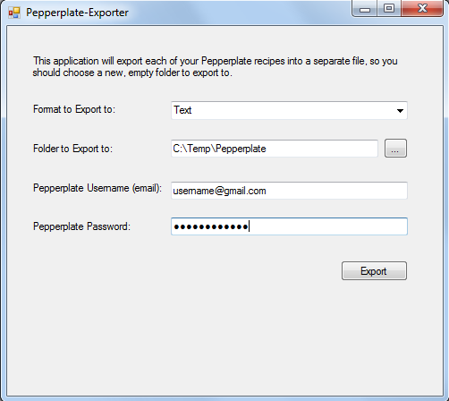

# Pepperplate-Exporter
A Windows app that will export your Pepperplate recipes to files

I had an existing application that I used to backup my Pepperplate recipes to files weekly, since I knew that Pepperplate could just stop operating one day.  When I heard that they were going to hold everyone's recipes ransom for a paid model, I quickly modified the application so that everyone could use it.

 - Only works on Windows
 - Requires [.NET 4.6.1 runtime](https://www.microsoft.com/en-us/download/details.aspx?id=49981)
 - No support - simply offered "as-is"

# How to Use

1. Download the latest version [here](https://github.com/wags1999/pepperplate-exporter/releases/download/v1.0/Pepperplate-Exporter.App.exe).
2. Run the Pepperplate-Exporter.App.exe.
3. Choose the format you want your recipes exported in and the folder to export them to.  
4. Enter your Pepperplate username and password.  These are not stored, nor sent anywhere.  They are only used to authenticate to Pepperplate.
5. Click Export!

